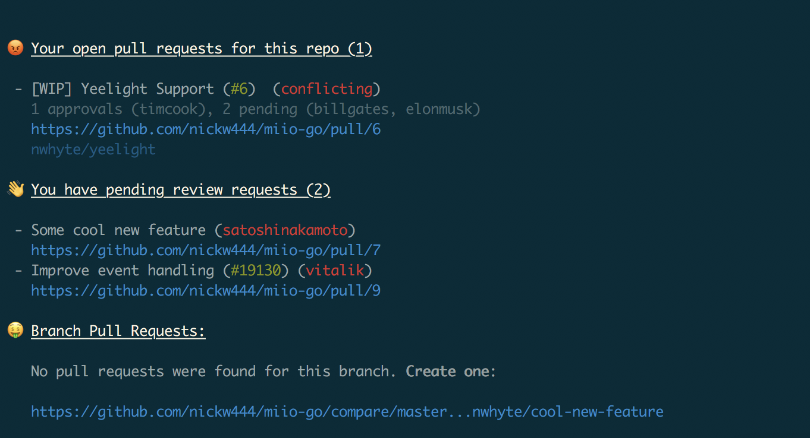

# Github Info

Show GitHub information on Git pre-push or on demand

### Requirements

- Python >= 3.6

### Setup

```
pip3 install github-info
```

### Usage

#### 1. Configure the tool

```
github-info configure
```

#### 2. Use it

```
github-info
```


